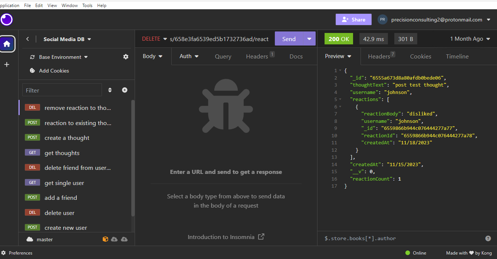
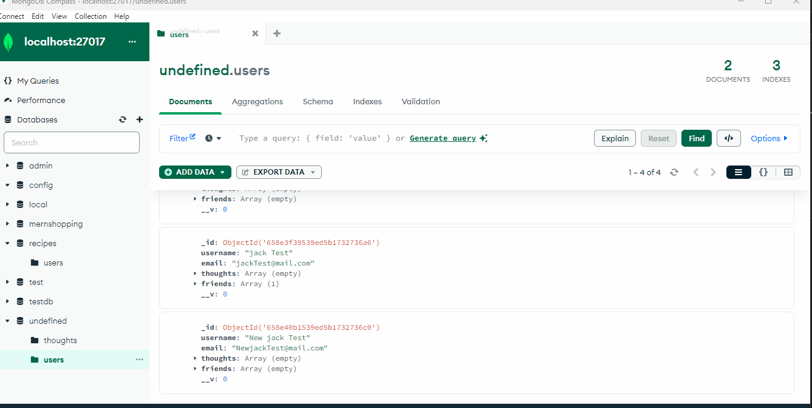

# 18 NoSQL: Social Network API

## Your Task

MongoDB is a popular choice for many social networks due to its speed with large amounts of data and flexibility with unstructured data. Over the last part of this course, you’ll use several of the technologies that social networking platforms use in their full-stack applications. Because the foundation of these applications is data, it’s important that you understand how to build and structure the API first.

Your Challenge is to build an API for a social network web application where users can share their thoughts, react to friends’ thoughts, and create a friend list. You’ll use Express.js for routing, a MongoDB database, and the Mongoose ODM. In addition to using the [Express.js](https://www.npmjs.com/package/express) and [Mongoose](https://www.npmjs.com/package/mongoose) packages, you may also optionally use a JavaScript date library of your choice or the native JavaScript `Date` object to format timestamps.

No seed data is provided, so you’ll need to create your own data using Insomnia after you’ve created your API.

Because this application won’t be deployed, you’ll also need to create a walkthrough video that demonstrates its functionality and all of the following acceptance criteria being met. You’ll need to submit a link to the video and add it to the README of your project.

## User Story

```md
AS A social media startup
I WANT an API for my social network that uses a NoSQL database
SO THAT my website can handle large amounts of unstructured data
```

## Acceptance Criteria

```md
GIVEN a social network API
WHEN I enter the command to invoke the application
THEN my server is started and the Mongoose models are synced to the MongoDB database
WHEN I open API GET routes in Insomnia for users and thoughts
THEN the data for each of these routes is displayed in a formatted JSON
WHEN I test API POST, PUT, and DELETE routes in Insomnia
THEN I am able to successfully create, update, and delete users and thoughts in my database
WHEN I test API POST and DELETE routes in Insomnia
THEN I am able to successfully create and delete reactions to thoughts and add and remove friends to a user’s friend list
```

## Mock Up

Routes:


MongoDB:


## Motivation

I was motivated to create this app to learn about NoSQL formating using MongoDB database, and the Mongoose ODM. In addition to implementing the native JavaScript `Date` object to format timestamps.

## Why

NoSQL is a popular choice for many social networks due to its speed with large amounts of data and flexibility with unstructured data. Over the last part of this course, I learned how to use several of the technologies that social networking platforms use in their full-stack applications. Because the foundation of these applications is data, it’s important that I understand how to build and structure the API first.

## What problem does it solve?

This application solves the problem of creating an API for a social network web application where users can share their thoughts, react to friends’ thoughts, and create a friend list.

## What did you learn?

I learned how to use mongoose to create models, and schemas for a NoSQL database. I also learned how to use the native JavaScript `Date` object to format timestamps.


## Installation

first type npm install in the terminal, then npm run dev in the terminal to start the server.

## Usage

You can use this web application to create a social network API where users can share their thoughts, react to friends’ thoughts, and create a friend list.

### Link to github repo

<https://github.com/precisecoding/Social-Network-API>

### Video Walkthrough Link

<https://drive.google.com/file/d/1C6RL1e4ZdmEZtmy7CJG1tcleEi1D3fq6/view>

### This site was built using netlify and render

MongoDB Atlas:
<https://www.mongodb.com/atlas/database>

### License

MIT License:
<https://opensource.org/licenses/MIT>
<https://choosealicense.com/licenses/mit/>
LICENSE file included in repository.

### Thanks to everyone for support and contributions

Sources used: <https://developer.mozilla.org/en-US/>, <https://www.w3schools.com/>, <https://stackoverflow.com/>. 